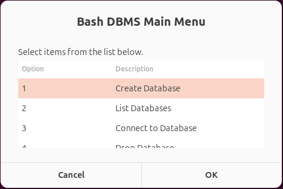
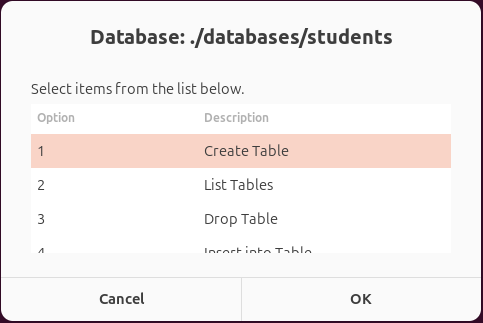

# **Bash DBMS (Database Management System)**

A simple **text-file-based Database Management System** implemented in **Bash** with a **Graphical User Interface** using **Zenity**.  
This project allows creating databases, tables, and performing basic CRUD operations (Create, Read, Update, Delete) using a simple and interactive GUI.

---

## **Table of Contents**
1. [Features](#features)  
2. [Installation](#installation)  
3. [Usage Guide](#usage-guide)  
    - [Main Menu](#main-menu)  
    - [Database Operations](#database-operations)  
    - [Table Operations](#table-operations)  
4. [Data Validation](#data-validation)  
5. [Example Screenshots](#example-screenshots)  
6. [Notes & Limitations](#notes--limitations)  
7. [Folder Structure](#folder-structure)  
8. [Contributing](#contributing)  
9. [License](#license)  

---

## **Features**
- Create, list, connect, and drop databases  
- Create, list, drop tables  
- Insert, select, update, and delete records  
- Primary key enforcement (uniqueness)  
- Data type validation: `INT`, `REAL`, `TEXT`, `DATE`  
- User-friendly GUI using Zenity  
- Works entirely in Bash, no external database required  

---
## Requirements

- **Bash** (tested on Linux)
- **Zenity** (GUI dialogs)
  
To install Zenity on Debian/Ubuntu:

```bash
sudo apt update
sudo apt install zenity

---

## **Installation**
1. **Clone the repository**

```bash
git clone https://github.com/ananmuhameed/Bash-Shell-Script-Database-Management-System.git
cd <Bash-Shell-Script-Database-Management-System>

2. **Make the main script executable**
chmod +x dbms.sh

2. **Run the script**
./dbms.sh

---

## Usage Guide

### Main Menu

- **Create Database** – create a new database folder.  
- **List Databases** – display all databases.  
- **Connect to Database** – access a specific database to manage its tables.  
- **Drop Database** – delete a database permanently.  
- **Exit** – close the program.  

### Table Menu

Once inside a database, you can:

- **Create Table**  
  - Enter table name (spaces are replaced with underscores automatically)  
  - Enter column names and data types (`INT`, `REAL`, `TEXT`, `DATE`)  
  - Select a Primary Key column  

- **List Tables** – show all tables in the database.  

- **Drop Table** – delete a table.  

- **Insert into Table**  
  - Enter values for each column  
  - Primary Key uniqueness is enforced  
  - Data types are validated  

- **Select From Table**  
  - View all records  
  - Search by a column value  
  - If no records match the search, an error is shown  

- **Update Table**  
  - Choose a column to update (**Primary Key cannot be updated**)  
  - Choose a column to match the record(s) to update  
  - Validate new value type  
  - Primary Key uniqueness is checked if updating a PK column  

- **Delete From Table**  
  - Choose a column to match  
  - Delete records matching the value  

- **Back to Main Menu**

---

## Screenshots

### Main Menu


### Table Menu


---

## Notes & Limitations

- Tables are stored as plain text files in their respective database folders.  
- Primary key constraints are enforced during Insert and Update.  
- Column names with spaces are automatically converted to underscores (`_`).  
- Search and update operations are case-sensitive.  
- Designed for single-user, local usage, not for concurrent multi-user environments.

---

## Project Structure

/databases/        # All databases are stored here
    /<database>/
        table1     # Tables as plain text files
        table2
dbms.sh            # Main script to run
screenshots/       # Screenshots for README
README.md          # Project documentation

---

## Contributing

If you'd like to contribute to this project, please follow these steps:

1. Fork the repository.
2. Create a feature branch:
   ```bash
   git checkout -b feature-name
3. Commit your changes:
   ```bash
   git commit -m "Add new feature"
4. Push to the branch:
   ```bash
   git push origin feature-name

---

## License

This project is open-source and licensed under the MIT License.  
Feel free to use, modify, and distribute it.


